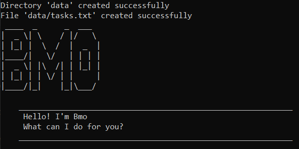

# User Guide
Duke is an application that helps a user to keep track of various tasks via a Command Line Interface (CLI).

* [Quick start](#quick-start)
* [Features](#features)
  * [Listing all tasks: `list`](#listing-all-tasks-list)
  * [Adding a todo task: `todo`](#adding-a-todo-task-todo)
  * [Adding a deadline task: `deadline`](#adding-a-deadline-task-deadline)
  * [Adding an event task: `event`](#adding-an-event-task-event)
  * [Marking a task as done: `done`](#marking-a-task-as-done-done)
  * [Deleting a task: `delete`](#deleting-a-task-delete)
  * [Listing tasks that occur on a date: `date`](#listing-tasks-that-occur-on-a-date-date)
  * [Finding tasks by a keyword: `find`](#finding-tasks-by-a-keyword-find)
  * [Exiting the program: `bye`](#exiting-the-program-bye)
  * [Saving the data](#saving-the-data)
* [Command summary](#command-summary)

--------------------------------------------------------------------------------------------------------------------

## Quick start

1. Ensure you have Java `11` or above installed in your Computer.

2. Download the latest `Duke.jar` from [here](https://github.com/Jane-Ng/ip/releases).

3. Copy the file to the folder you want to use as the _home folder_ for Duke.

4. Open a command window in that folder

5. Run the command `java -jar Duke.jar` (i.e., run the command in the same folder as the jar file). The welcome screen similar to the below should appear.<br>
   
   
6. Type the command in the command window and press Enter to execute it. e.g. typing **`list`** and pressing Enter will list all tasks.<br>
   Some example commands you can try:
   
   * **`todo`**`read book` : Adds a todo task `read book` to the task list.
  
   * **`delete`**`3` : Deletes the 3rd task shown in the task list.
   
   * **`date`**`2020-12-15` : Lists all deadline/events that occurs on `2020-12-15`.
   
   * **`bye`** : Exits the app.
   
7. Refer to the [Features](#features) below for details of each command.

--------------------------------------------------------------------------------------------------------------------
   
## Features 

### Listing all tasks: `list`

Shows a list of all tasks in the task list.

Format: `list`

### Adding a todo task: `todo`

Adds a todo task to the task list.

Format: `todo TASK_DESCRIPTION`

Examples: 
* `todo revise CS2113T`
* `todo read book`
  ```
  Got it. I've added this task:
    [T][✘] read book
  Now you have 1 task in the list.
  ```

### Adding a deadline task: `deadline`

Adds a deadline task to the task list.

Format: `deadline TASK_DESCRIPTION /by DATE(yyyy-MM-dd) TIME(HHmm)`

* Ensure that the format for `DATE` is `yyyy-MM-dd`.
* Ensure that the format for `TIME` is `HHmm`.

Examples:
* `deadline do ip Level-9 /by 2020-10-01 2359`
* `deadline return book /by 2020-12-01 1800`
  ```
  Got it. I've added this task:
    [D][✘] return book (by: Dec 01 2020 06:00PM)
  Now you have 2 tasks in the list.
  ```

### Adding an event task: `event`

Adds an event task to the task list.

Format: `event TASK_DESCRIPTION /at DATE(yyyy-MM-dd) START_TIME(HHmm)-END_TIME(HHmm)`

* Ensure that the format for `DATE` is `yyyy-MM-dd`.
* Ensure that the format for `START_TIME` and `END_TIME` are `HHmm`.

Examples:
* `event birthday party /at 2020-12-02 1800-2359`
* `event project meeting /at 2020-12-15 1400-1600`
  ```
  Got it. I've added this task:
    [E][✘] project meeting (at: Dec 15 2020 02:00PM-04:00PM)
  Now you have 3 tasks in the list.
  ```

### Marking a task as done: `done`

Marks the specified task as done in the task list.

Format: `done TASK_NUMBER`

* Marks the task at the specified `TASK_NUMBER` as done.
* The task number refers to the index number shown in the displayed task list.
* The task number **must be a positive integer** 1, 2, 3, ...

Examples:
* `done 1` marks the 1st task as done in the task list.
  ```
  Nice! I've marked this task as done:
    [T][✓] read book
  ```

### Deleting a task: `delete`

Deletes the specified task from the task list.

Format: `delete TASK_NUMBER`

* Deletes the task at the specified `TASK_NUMBER`.
* The task number refers to the index number shown in the displayed task list.
* The task number **must be a positive integer** 1, 2, 3, ...

Examples:
* `delete 1` deletes the 1st task in the task list.
  ```
  Noted! I've removed this task:
    [T][✓] read book
  Now you have 2 tasks in the list.
  ```

### Listing tasks that occur on a date: `date`

Lists all deadline/event tasks in the task list occurring on a specific date.

Format: `date DATE(yyyy-MM-dd)`

* Lists the tasks with the specified `DATE`.
* Ensure that the format for `DATE` is `yyyy-MM-dd`.

Examples:
* `date 2020-12-01`
* `date 2020-12-15`
  ```
  Here are the tasks occurring on this date:
  1.[E][✘] project meeting (at: Dec 15 2020 02:00PM-04:00PM)
  2.[E][✘] birthday party (at: Dec 15 2020 06:00PM-11:59PM)
  ```

### Finding tasks by a keyword: `find`

Finds all tasks whose description contains the given keyword.

Format: `find KEYWORD`

* The search is case-insensitive. e.g. `book` will match `Book`
* The order of the keywords matter. e.g. `read book` will not match `read CS2113T book`
* Only the task description is searched.
* Partial words will be matched. e.g. `book` will match `books`

Examples:
* `find project meeting`
* `find book`
  ```
  Here are the matching tasks in your list:
  1.[D][✘] return book (by: Dec 01 2020 06:00PM)
  2.[T][✘] read book
  ```

### Exiting the program: `bye`

Exits the program.

Format: `bye`

### Saving the data
Duke data are saved in the hard disk automatically after any command that changes the data. There is no need to save manually.

--------------------------------------------------------------------------------------------------------------------

## Command summary
Action | Format, Examples
--------|------------------
**Bye** | `bye`
**Date** | `date DATE(yyyy-MM-dd)`<br> e.g., `date 2020-12-15`
**Deadline** | `deadline TASK_DESCRIPTION /by DATE(yyyy-MM-dd) TIME(HHmm)`<br> e.g., `deadline return book /by 2020-12-01 1800`
**Delete** | `delete TASK_NUMBER`<br> e.g., `delete 1`
**Done** | `done TASK_NUMBER`<br> e.g.,`done 3`
**Event** | `event TASK_DESCRIPTION /at DATE(yyyy-MM-dd) START_TIME(HHmm)-END_TIME(HHmm)`<br> e.g., `event project meeting /at 2020-12-15 1400-1600`
**Find** | `find KEYWORD`<br> e.g., `find book`
**List** | `list`
**Todo** | `todo TASK_DESCRIPTION`<br> e.g, `todo read book`